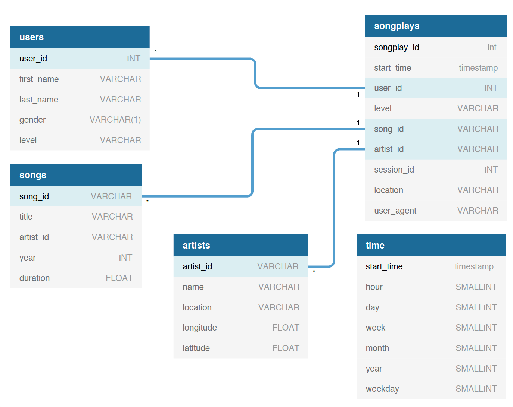
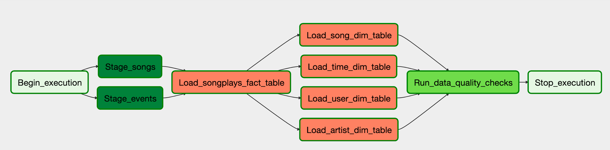

# Project summary
This is the fifth project of Udacitys Data Engineering Nanodegree. For this project, I am trying to help a music streaming startup company called Sparkify to introduce more automation and monitoring to their data warehouse ETL pipelines and come to the conclusion that the best tool to achieve this is Apache Airflow.

They have decided to bring you into the project and expect you to create high grade data pipelines that are dynamic and built from reusable tasks, can be monitored, and allow easy backfills. They have also noted that the data quality plays a big part when analyses are executed on top the data warehouse and want to run tests against their datasets after the ETL steps have been executed to catch any discrepancies in the datasets.

The source data resides in S3 and needs to be processed in Sparkify's data warehouse in Amazon Redshift. The source datasets consist of CSV logs that tell about user activity in the application and JSON metadata about the songs the users listen to.

## Database Design

The database uses start schema model. There is only one fact table, **songplays**, and four dimenstion tables, **users, songs, artists, and time**.

## ETL Process
The tool used for scheduling and orchestrationg ELT is Apache Airflow.

### Files:
`README.md`
:  this file

`example-dag.png`
:  image of DAG workflow

`iac_redshift.py`
:  Script to build Redshift cluster

`dags/udac_example_dag.py`
:  Main DAG

`dags/create_tables.sql`
:  SQL script to build Redshift tables

`plugins/helpers/sql_queries.py`
:  *Select* statements used to populate tables

`plugins/operators/data_quality.py`
:  DAG operator used for data quality checks

`plugins/operators/load_dimensions.py`
:  DAG operator used to populate dimension tables in a STAR schema

`plugins/operators/load_fact.py`
:  DAG operator used to populate fact tables

`plugins/operators/stage_redshift.py`
:  DAG operator to populate staging tables from source files

### Prerequisites
1.  Start Redshift cluster
2.  Start Airflow, e.g. /opt/airflow/start.sh
3.  Open Airflow web browser and *create* the following:

        Airflow AWS Connection
                    Conn id:  aws_credentials
                    Login:  [REDACTED]
                    Password: [REDACTED]

        Airflow Redshift Connection
                    Conn id:  redshift
                    Conn Type:  Postgres
                    Host:   [REDACTED]
                    Schema: dev
                    Login:  awsuser
                    Password: Passw0rd
                    Port: 5439

        Airflow Variable
                    Key:  s3_bucket
                    Value:  udacity-dend
4.  From the DAGs page, click the *Trigger Dag* link for `udac_example`.

Notes:
- Create a `dwh.cfg` file and run `iac_redshift.py` to create (and teardown) a Redshift cluster and identify Airflow connections and variables.

## Data Sources
Log data: s3://udacity-dend/log_data
Song data: s3://udacity-dend/song_data

## Destinations
Data is inserted into an Amazon Redshift Cluster. The cluster uses a star schema and is structured as follows:

**Fact Table:**
* `songplays`

**Dimension Tables**
* `users`
* `songs`
* `artists`
* `time`

**Staging Tables**
* `stage_events`
* `stage_songs`

## Instructions
1. Add LOG_JSONPATH to COPY command to prevent empty fields in staging_events 
table.
2.  Copied original `create_tables.sql` to dags directory.  Updated `CREATE TABLE` 
statements to `CREATE TABLE IF NOT EXISTS`.  Incorporated this file into a task 
and added to workflow.
3.  Data quality checks allow two types of checks.  `check_sql` runs a SQL 
statement and compares the result against an expected result.  The `dual_sql1` 
and `dual_sql2` tags executes both statements and compares the results against 
each other.
